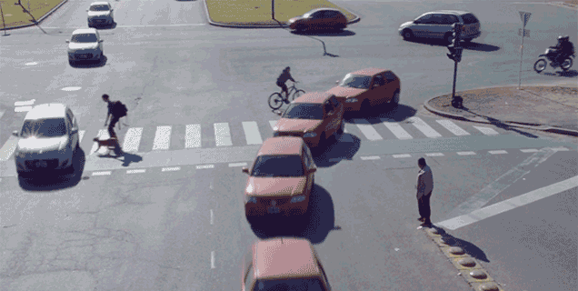

# Self Driving Car

This project uses convolutional neural network to automatically play a game (in my case, driving a car in Need For Speed). It captures the frames of the game you play along with what input you give, i.e., what keypresses you make to play the game. For eg, in my case, I gave W, A, S, and D (to drive the car). The program then balances the data, such that the number of frames for a given input in training data is same. For eg, 5000 frames to which you pressed 'W', i.e., drove forward, 5000 frames to which you pressed 'A', and 5000 frames to which you pressed 'D'. Then, we shuffle the data. We don't have to worry because the input you give and the frame for which you gave the input will not get shuffled. Instead, they will get shuffled together, as a whole.We then give the now balanced and shuffled training data to a model, train it, and finally test it.

Run Need For Speed Most Wanted (old version) (or any game for that matter) in a windowed mode with dimensions 50, 50, 800, 500. (You could use DxWnd)

Run Python scripts as numbered. Make sure your python IDLE/CMD is only on the right side of your screen.

We run '1 get_data.py' to capture the screen and input data. Game needs to be open, and you need to play the game(how you want the neural network to play).

We use the captured data as training data for our convolutional neural network.

We have a new file - training_data_{batch number}.npy

We run '2 balance_data.py' to balance the data to make sure we don't over fit. Game need not be open.

We have a new file - training_data_{batch number}_{balanced}.npy

We run '3 combine_data.py' to combine all our mini-batch files into one single file.

We have a new file - 'final_data.npy'

We run '4 train_model.py' to train our model using training_data_v2.npy Game need not be open.

We run '5 test_model.py' to test our trained model. Game needs to be open and selected after running '5 test_model.py'. Wait for the countdown, and your car should drive automatically.

If you wish, you can run '1.2 check_data.py' to see the amount of original training data and the amount of training data you give to the neural network, since a significant amount of data will be lost during balancing (in fact, that is why we balance, to make sure that the game inputs are all even and not one input is more than or less than others).

Feel free to pull request or make changes according to your convinience. You can even tweak the codes such that it runs for any game you like. I didn't include my training data and trained model as I want you to use this neural network to play any game that you like. I would also suggest you to start with rather simple inputs, than complicated keypresses, as you need to have a lot of training data and balance it such that each and every input has the same number of frames as training data.

