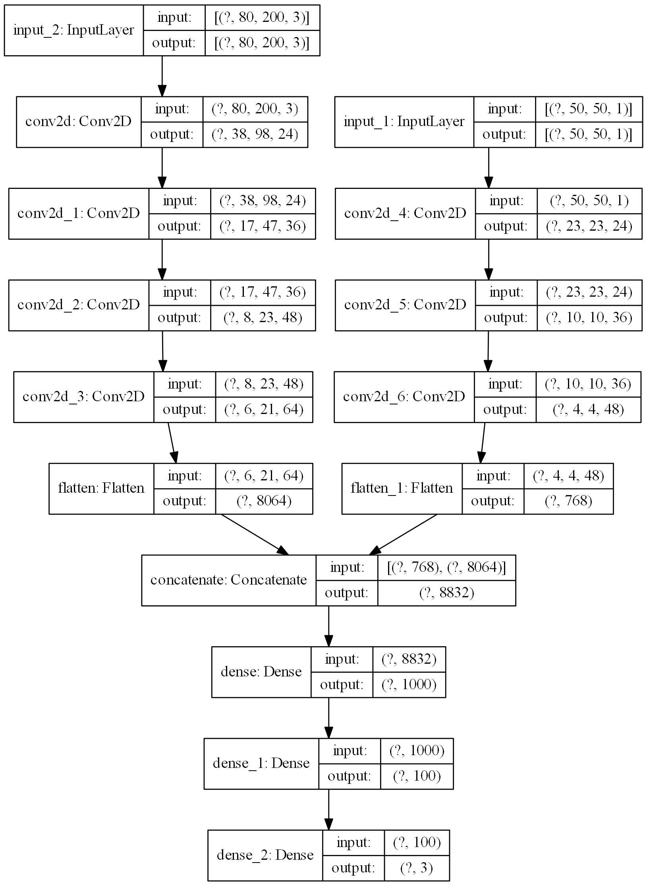
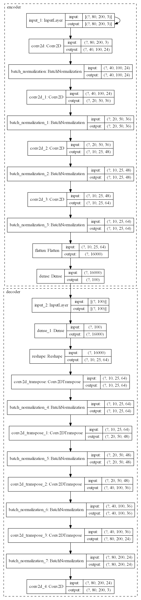

# Self Driving Car

> This project is mainly focused on End-to-End Deep Learning for Self-Driving-Cars. Uses raw image data, a convolutional neural network, and an autoencoder for autonomous driving in Need For Speed Most Wanted (2005) v1.3 game.

## Sections:
* [What's New](#changelog)
* [Demo](#demo)
* [Installation](#installation)
* [Working](#working)
* [DriveNet](#DriveNet)
* [CrashNet](#CrashNet)
* [LaneFinder](#Lanefinder)
* [Citations](#citations)
* [Todo](#todo)

---
## Changelog
Version 2.0
* Updated from tflearn to Keras API on top of tensorflow 2.0
* Updated from alexnet to new architecture.
* Using minimap also as an input, along with road images.

## Demo


## Installation
`python -m pip install --user --requirement requirements.txt`

All required modules (except the built-ins) are listed below.
```
opencv-python
numpy
psutil
pandas
sklearn
tensorflow
matplotlib
```

## Working
1. Visualizing Region of Interest - to make sure that we are capturing the areas that we want and nothing extra.
    * [Visualize screen](visualize_screen.py) can be used to see the area of the road that is being captured when recording training data.
    * [Visualize map](visualize_map.py) can be used to see the area of the minimap that is located in the bottom-left corner, that is captured when recording training data.

1. Getting Training Data - capturing raw frames along with player's inputs.
    * [Get data](get_data.py) is used to capture the ROI found in step 1. We capture both the road and the minimap per observation as features, along with the player's input as label.
    * The captured road frame is resized to (80, 200, 3)
    * The captured minimap frame is resized to (50, 50, 1)

1. Balancing the data - The raw data is balanced to avoid bias.
    * [Balance data](balance_data.py) removes the unwanted bias in the training data.
    * The raw data has most of the observations with labels for _forward_ with few observations with labels for _left_ or _right_.
    * We thus discard the excess amount of unwanted data that has label as _forward_. Keep in mind that we do __lose a lot of data__.

1. Combining the data - The balanced files can now be joined together to form one final data file.
    * [Combine data](combine_data.py) is used to join all balanced data for easier loading of data during training process.
    * All batches of balanced data is now combined together to form _final\_data.npy_ file.
    * This file has 2 images as features, with shape (80, 200, 3) and (50, 50, 1), respectively, and a one-hot-encoded label with 3 classes.

1. Training the Neural Network - [DriveNet](#drivenet) is used as the convolutional neural network for autonomous driving. [CrashNet](#crashnet), an autoencoder, is used to for anomaly detection during autonomous driving.
    * [Train model](train_model.py) is used to train DriveNet over a max of 100 epochs.
    * [Train CrashNet](train_crashnet.py) is used to train CrashNet.
    * Training is regulated by EarlyStopping Callback, monitoring validation_loss with a patience of 3 epochs.
    * Adam optimizer is used, with learning rate set to 0.001
    * No data augmentation is done.

1. Testing the model - Final testing done in the game.
    * [Test model](test_model.py) is used to actually run the trained model and control the car real-time. For CrashNet, a threshold of 0.0095 is used for anomaly detection. (Reconstruction loss - Mean Squared Error)

## DriveNet
Graph of [DriveNet](drivenet.py), rendered using plot_model function.



* **NOTE:** This architecture is heavily inspired by the paper "Variational End-to-End Navigation and Localization" by Alexander Amini and others. Refer to the [citation](#citations) section for more details.

## CrashNet
Graph of [CrashNet](crashnet.py), rendered using plot_model function.



## LaneFinder
Pipeline is as follows:
* Convert image to grayscale
* Apply Gaussian Blur
* Canny Edge Detection (threshold values calculated automatically)
* Masking region of interest
* Probabilistic Hough Transform
* Selecting 2 lines(lanes) averaged over
    * If both lines have negative slope, go right
    * If both lines have positive slope, go left
    * If both lines have different slope, go straight

**NOTE:** This pipeline is almost similar to the one used in Sentdex's Python plays GTA-V. Refer to the [citations](#citations) section for more details.

## Citations
1. [MIT - Intro to Deep Learning Course](https://introtodeeplearning.com/ "Go to HomePage")
1. [Variational End-to-End Navigation and Localization](https://arxiv.org/abs/1811.10119v2 "Go to arxiv page")
1. [Sentex's Python Plays GTA-V](https://github.com/Sentdex/pygta5 "Go to GitHub")
1. [AlexNet](https://papers.nips.cc/paper/4824-imagenet-classification-with-deep-convolutional-neural-networks.pdf "Go to pdf")

## Todo
* Use .hdf5 files instead of .npy files for better memory utilization.
    * Switch to PyTorch if dealing with .hdf5 datasets.
* Implement some sort of reinforcement learning algorithm to avoid collecting data.
* Merge LaneFinder, DriveNet and CrashNet for better driving.
* Carla
* TORCS
* VDrift
* Beam.ng
* Add a control filter for the output, maybe a low pass filter
* Vagrant multiple VM - run the game with different camera views
* Use a cheat engine that tracks car's relative position, speed, angle, etc.

---
Open to suggestions. Feel free to fork this repository. If you would to use some code from here, please do give the required citations and references.
